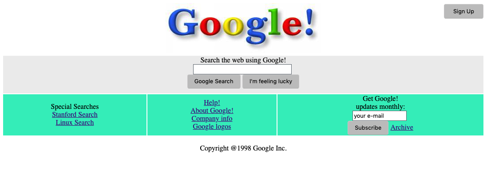
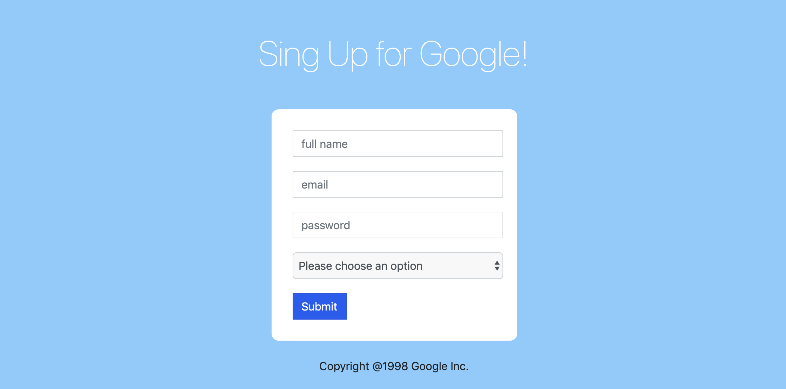

# Google!
> A short revision of brand old Google! web app.

It shows representation of Google! web site content back in `1998`. Have a fun!

## Usage example
**Home page**

Open `index.html` file in your browser.

**Signup page**

Open `signup.html` file in your browser or click `Sign Up` button on home page to redirect.

## Meta

Volodymyr Yahello – vyahello@gmail.com

[https://github.com/vyahello](https://github.com/vyahello)

## Contributing

1. Fork it (https://github.com/vyahello/old-style-google)
2. Create your feature branch (`git checkout -b feature/fooBar`)
3. Commit your changes (`git commit -am 'Add some fooBar'`)
4. Push to the branch (`git push origin feature/fooBar`)
5. Create a new Pull Request
